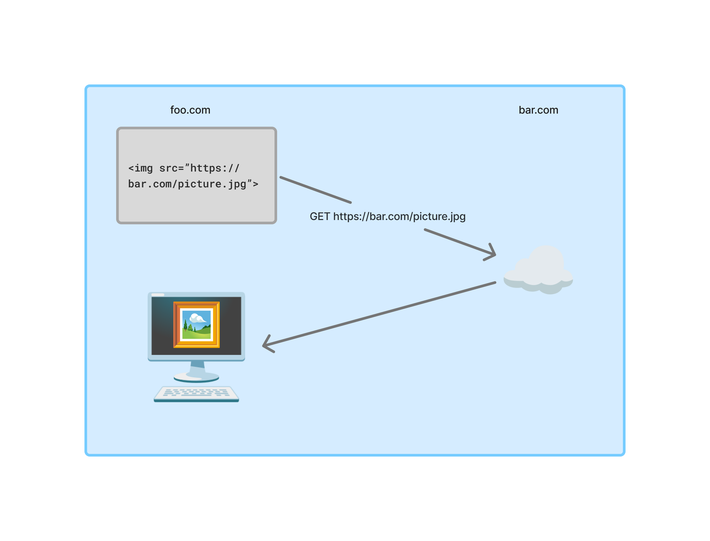

# [Cross-Origin Resource Sharing](https://en.wikipedia.org/wiki/Cross-origin_resource_sharing)



- 웹 페이지는 cross-origin 이미지, 스타일시트 등을 임베드할 수 있음.
- 특정 "cross-domain" 요청은 동일 오리진 보안 정책에 의해 금지될 수 있음.

## Simple request
HTTP 헤더가 [CORS-safelisted request-header](https://developer.mozilla.org/en-US/docs/Glossary/CORS-safelisted_request_header) 일 때
- `Accept`
- `Accept-Language`
- `Content-Language`
- `Content-Type`
- `Range`

(각 헤더마다 적용되는 [세부 규칙](https://developer.mozilla.org/en-US/docs/Glossary/CORS-safelisted_request_header#additional_restrictions)이 존재한다.)


### Example
- 유저가 `http://www.example.com` 방문함
- 이 페이지에서 `http://service.example.com`에 데이터를 요청함
- CORS 호환 브라우저는 다음과 같이 cross-origin 요청을 수행

1\. 브라우저에서 GET 요청을 할 때 `Origin` 헤더를 만든다.
```
GET /
Host: service.example.com
Origin: http://www.example.com
```

2\. 요청받은 서버는 셋 중 하나의 응답을 한다.

- 응답에 포함된 `Access-Control-Allow-Origin` (ACAO) 헤더가 현재 페이지를 가리킴
  ```
  Access-Control-Allow-Origin: http://www.example.com
  ```

- 응답에 포함된 `Access-Control-Allow-Origin` (ACAO) 헤더가 와일드카드임
  ```
  Access-Control-Allow-Origin: *
  ```

- 서버가 cross-origin request를 허용하지 않으면 에러를 반환함


## Preflight
특정 유형의 cross-domain 요청을 할 때 모던 브라우저는 "preflight" 요청을 한다.
- 요청에 의해 유저의 데이터가 변형될 수 있기 때문

```
OPTIONS /
Host: service.example.com
Origin: http://www.example.com
Access-Control-Request-Method: PUT
```

서버가 요청을 허용하면 다음과 같은 헤더와 함께 응답한다.
```
Access-Control-Allow-Origin: http://www.example.com
Access-Control-Allow-Methods: PUT
```

브라우저는 preflight 응답에 에러가 없음을 확인 후 진짜 요청을 한다.


## Headers
- CORS와 관련된 헤더

Requeest headers
- `Origin`
- `Host`
- `Access-Control-Request-Method`
- `Access-Control-Request-Headers`

Response headers
- `Access-Control-Allow-Origin`
- `Access-Control-Allow-Credentials`
- `Access-Control-Expose-Headers`
- `Access-Control-Max-Age`
- `Access-Control-Allow-Methods`
- `Access-Control-Allow-Headers`

### Custom headers
페이지 스크립트가 커스텀 헤더를 사용하면 브라우저는 다음과 같은 preflight를 한다.
```
OPTIONS /data HTTP/1.1
Host: service.example.com
Origin: http://www.example.com
Access-Control-Request-Method: POST
Access-Control-Request-Headers: X-Custom-Auth
```

### [Credentials](https://developer.mozilla.org/en-US/docs/Web/HTTP/Reference/Headers/Access-Control-Allow-Credentials)
페이지 스크립트는 `fetch()`함수의 `credentials: "include"` 옵션을 사용해서 cross-origin 요청에 credential을 포함할 수 있다.
- 쿠키
- TLS 인증서
- 유저이름, 비밀번호를 포함한 헤더

브라우저가 preflight 요청을 할 때
- credential은 포함되지 않음
- 서버가 `Access-Control-Allow-Credentials: true` 헤더를 응답하면 실제 요청에서 credential을 포함함
- 그렇지 않으면 브라우저는 네트워크 에러가 발생함

브라우저가 preflight 요청을 하지 않을 때
- credential을 포함함
- 서버가 `Access-Control-Allow-Credentials: true` 헤더를 응답하지 않으면 브라우저는 네트워크 에러가 발생함


## XSRF Attack
0. 유저가 `goodwebsite.com`에 로그인해서 관련 쿠키가 브라우저에 저장됨
1. 유저가 `evilwebsite.com`에 방문함
2. `evilwebsite.com`의 스크립트가 실행되고 `goodwebsite.com`에 요청을 보냄
3. 브라우저가 `goodwebsite.com` 요청에 쿠키를 포함할 수 있음

[쿠키 어트리뷰트](https://developer.mozilla.org/en-US/docs/Web/HTTP/Guides/Cookies#security)로 막을 수 있다.
```
Set-Cookie: id=a3fWa; Expires=Thu, 21 Oct 2021 07:28:00 GMT; Secure; HttpOnly
```
- `Secure`: HTTPS만 허용
- `HttpOnly`: JavaScript에 의한 접근 차단
- `SameSite=Strict`: 같은 origin일 때 허용

브라우저가 preflight 또는 non-preflight 요청을 하면 서버의 정책에 의해 막을 수 있다.
- 서버에서 `Origin` 헤더를 확인
- 정책에 따라 `Access-Control-Allow-Credentials` 헤더를 응답
