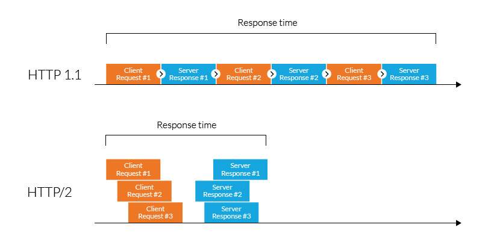
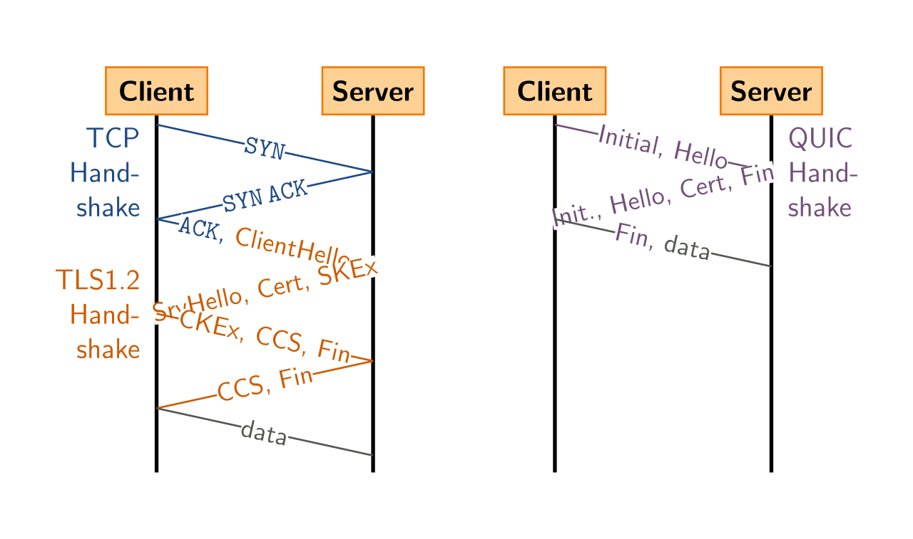

# [HyperText Transfer Protocol](https://en.wikipedia.org/wiki/HTTP)
> Hypermedia 정보 시스템을 위한 application layer 프로토콜

- Tim Berners-Lee (1989)
- HTTP/1 (1996)
- HTTP/1.1 (1997)
- HTTP/2 (2015)
- HTTP/3 (2022)

## HTTP Request
### Syntax
<table>
  <tr>
    <th>줄 개수</th>
    <th>내용</th>
    <th>예시</th>
  </tr>
  <tr>
    <td>1</td>
    <td>a request line</td>
    <td>
      <pre>GET /images/logo.png HTTP/1.1</pre>
    </td>
  </tr>
  <tr>
    <td>0 or more</td>
    <td>request header fields</td>
    <td>
      <pre>Host: www.example.com
Accept-Language: en
</pre>
    </td>
  </tr>
  <tr>
    <td>1</td>
    <td>an empty line</td>
    <td>
      <pre></pre>
    </td>
  </tr>
  <tr>
    <td>0 or more</td>
    <td>an optional message body</td>
    <td>
      <pre>John Doe</pre>
    </td>
  </tr>
</table>

### Methods
<table>
  <tr>
    <th>메소드</th>
    <th>설명</th>
  </tr>
  <tr>
    <td>GET</td>
    <td>리소스 상태를 전달</td>
  </tr>
  <tr>
    <td>HEAD</td>
    <td>
      리소스 상태를 response header로 전달 
      페이지가 사용가능한 상태인지, 파일 메타데이터를 빨리 확인하고 싶을 때
    </td>
  </tr>
  <tr>
    <td>POST</td>
    <td>리소스가 request와 같은 상태가 되도록 처리</td>
  </tr>
  <tr>
    <td>PUT</td>
    <td>
      리소스가 request와 같은 상태가 되도록 처리 
      POST와 다르게 대상의 위치를 명시해야함.
    </td>
  </tr>
  <tr>
    <td>DELETE</td>
    <td>리소스의 상태 삭제</td>
  </tr>
  <tr>
    <td>
      <a href="https://en.wikipedia.org/wiki/#HTTP_CONNECT_method">CONNECT</a>
    </td>
    <td>HTTP tunneling, Proxy 연결 요청</td>
  </tr>
  <tr>
    <td>OPTIONS</td>
    <td>리소스가 지원하는 HTTP 메소드를 요청</td>
  </tr>
  <tr>
    <td>TRACE</td>
    <td>
      리소스가 수신한 요청을 response body로 전달 
      변경 사항을 확인할 수 있음
    </td>
  </tr>
  <tr>
    <td>PATCH</td>
    <td>
      request에 정의된 부분 업데이트로 리소스의 상태를 일부 변경 
      파일 전체를 전달하지 않아서 네트워크 전송량 절약
    </td>
  </tr>
</table>

#### Safe method
- 서버에 영향이 없는 메소드
- read-only
- GET, HEAD, OPTIONS, TRACE

#### Idempotent method
- 여러번 시도해도 결과가 똑같은 요청
- PUT, DELETE, safe methods

#### Cacheable method
- response를 재사용할 수 있는 메소드
- GET, HEAD, POST

#### POST vs PUT
|      | POST | PUT |
|------|------|-----|
|차이점 | 대상 자원의 위치를 모름 | 대상 자원의 위치를 앎 |
| 예시  | 회원가입 (유저 아이디를 모름) | 비밀번호 변경 (유저 아이디를 앎) |

## HTTP Response
### Syntax
<table>
  <tr>
    <th>Lines</th>
    <th>Content</th>
    <th>Example</th>
  </tr>
  <tr>
    <td>1</td>
    <td>a status line</td>
    <td>
      <pre>HTTP/1.1 200 OK</pre>
    </td>
  </tr>
  <tr>
    <td>0 or more</td>
    <td>response header fields</td>
    <td>
      <pre>Content-Type: text/html</pre>
    </td>
  </tr>
  <tr>
    <td>1</td>
    <td>an empty line</td>
    <td>
      <pre></pre>
    </td>
  </tr>
  <tr>
    <td>0 or more</td>
    <td>an optional message body</td>
    <td>
      <pre>Hello, John Doe!</pre>
    </td>
  </tr>
</table>

### Status code
| 코드 | 요약 | 설명 |
|-----|-----|-----|
| 1XX | informational | 요청 수신 확인, 계속 진행 |
| 2XX | successful | |
| 3XX | redirection | 요청을 완료하기 위해 추가 작업이 필요함 |
| 4XX | client error | |
| 5XX | server error | |

## [HTTP/2](https://en.wikipedia.org/wiki/HTTP/2)

- From [Imperva](https://www.imperva.com/learn/performance/http2/)

| 기능 | 장점 |
|-----|-----|
| HPACK | HTTP 헤더 압축 |
| [Server push](https://en.wikipedia.org/wiki/HTTP/2_Server_Push) | 클라이언트가 필요한 자원을 예상해서 미리 전송 (문제가 많아서 사용 감소) |
| Request prioritization | 페이지 로드에 필요한 요소에 우선순위를 둘 수 있음 |
| Multiplexing | html, js, css 등 여러가지 자원을 요청할 때 하나의 TCP 연결만 사용 |

vs HTTP/1.1
- HTTP/1.1 시맨틱을 그대로 사용
- 데이터 프레임, 전송하는 방법을 바꿈

Head-of-line blocking (TCP level)
- TCP multiplexing의 문제
- 하나의 TCP 패킷이 분실되면 복구할때까지 다른 모든 스트림이 대기

## HTTP/3

- From [Wikipedia](https://en.wikipedia.org/wiki/QUIC)

HTTP/3는 QUIC transport layer 프로토콜을 사용해서 HTTP/2의 단점을 개선한다.

| 기능 | 장점 |
|-----|-----|
| 3-way handshake에 TLS과정 포함 | 처음 연결 속도가 빠름 |
| UDP 사용, 각 스트림을 독립적으로 관리 | 에러가 발생해도 다른 스트림에 영향을 주지 않음 |
| 패킷을 독립적으로 암호화 | 패킷을 받은 즉시 복호화 가능 |
| Connection identifier | 네트워크 환경이 변해도 연결을 빠르게 복구할 수 있음 |
